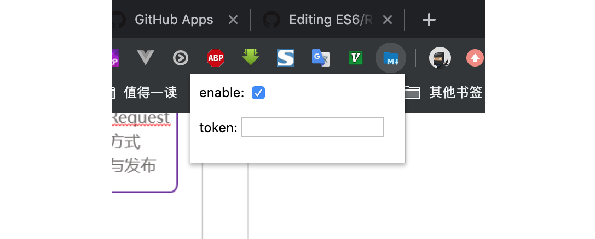

### github_md

Markdown 文档解析器，预览md文件
> 此工具为 ```Chrome 插件``` ，需要在Chrome浏览器环境下使用

<br>

#### 特点

* Markdown语法为：```GitHub Flavored Markdown```
* 当md文件内容改变时，实时渲染并展示
* 无过多的配置，开箱即用

<br>

#### 使用方法

* 安装 github_md ，单独下载 [crx文件](https://github.com/chinatjc/github_md) ，打开 Chrome Extensions (chrome://extensions/)，把crx文件拖到里面，完成安装
* 需要给md文件开启服务器环境（非服务器环境下，无法watch md文件的改变)
* 需要在 github_md 插件的[设置菜单](#设置菜单)中填写 GitHub token（[获取GitHub token](#获取 GitHub token)），否则每小时只能解析md文件```60```次
* 在 Chrome浏览器 中打开 md文件 的URL，即可看到解析后的Markdown
* 若想关闭插件解析Markdown，可在设置菜单里去掉 ```enable``` 勾选项

<br>

##### 设置菜单

浏览器右上角，点击插件图标，即可弹出插件设置菜单，选项分别是：enable、token



<br>

##### 获取 GitHub token

* Github -> Settings -> Developer settings -> Personal access tokens -> Generate new token
* 点击 Generate new token 按钮后，即可打开 New personal access token 设置页面
* 填写 Note 后，直接点击 Generate token 按钮后，即可获取 token 值
* token 展示页面只展示一次，要保存好 token 值

<br>

##### 实时更新，无需手动刷新


